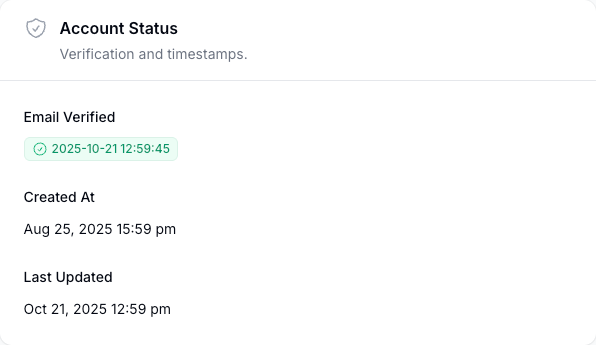

# 🔓 US Local Directory — Enable Login Guide

## Overview
This guide provides step-by-step instructions for enabling login access for users in the US Local Directory platform. This example demonstrates enabling login for a **Manager** role user.

---

## 🎯 Purpose & Use Cases

### When to Use This Process
- **New user account creation** — When a new user needs access to the platform
- **Account reactivation** — When a disabled account needs to be re-enabled
- **Email verification required** — When a user's email address needs to be verified before access
- **Manager oversight** — When managers need to enable access for their team members

### Who Can Enable Login
- **Supervisors** — Can enable login for Agents and Managers
- **Administrators** — Can enable login for all user roles
- **System Administrators** — Full access to enable any user

---

## 📋 Prerequisites

Before starting the enable login process:
- [ ] User account must exist in the system
- [ ] User's email address must be registered
- [ ] You must have appropriate permissions to enable user accounts
- [ ] User must have been assigned the correct role (Customer, Agent, Manager, Supervisor, Admin)

---

## 🔧 Step-by-Step Enable Login Process

### Step 1: Access User Management Interface
Navigate to the user management section of your dashboard and locate the user account that needs login enabled.

**Actions:**
1. Log into your dashboard with appropriate permissions
2. Navigate to **User Management** section
3. Search for the user by name, email, or employee ID
4. Locate the specific user account (in this example: a Manager user)

---

### Step 2: Select Enable Login Option
Once you've found the user account, access the account settings to begin the enable login process.

**Actions:**
1. Click on the user's account or profile
2. Look for **Account Status** section
3. Identify the **Email Verified** if green or has datetime, that means the user is already allowed to login

---

### Step 3: Initiate Email Verification
Click the verify button to send a verification email to the user's registered email address.

**Actions:**
1. Locate the **Verify** in the top right more options menu [...] button
2. Confirmation message should show asking if you want to allow the user to sign-in

---

### Step 4: Verify Account Status Update
Confirm that the account status has been updated in the system.

**Verification Checklist:**
1. **Account Status:** Should show "Email Verified" with datetime
2. **Verification Date:** Should display the date when verification was completed
3. **Access Permissions:** Should reflect the assigned role (Manager in this example)

**What to Look For:**
- ✅ Date stamp showing when verification occurred
- ✅ Login capabilities are now enabled
- ✅ User can now access their role-specific dashboard

---

### Step 5: Test Access via Impersonation (Optional)
For verification purposes, you can test the user's access by using the impersonation feature.

**Impersonation Process:**
1. Locate the **Impersonate** option in the top right [...] for the user
2. Click to access the user's account perspective
3. This allows you to verify that login and permissions are working correctly
4. Useful for troubleshooting access issues

**Safety Notes:**
- Only use impersonation for verification and troubleshooting
- Always log out of impersonation session when finished
- Impersonation actions may be logged for security purposes

---

### Step 6: Successful Login Verification
Confirm that the impersonation (and by extension, user login) is working successfully.

**Success Indicators:**
1. ✅ Successfully logged into user's account perspective
2. ✅ User dashboard loads correctly
3. ✅ Role-specific features and permissions are accessible
4. ✅ Navigation and functionality work as expected

**Final Verification:**
- User can now log in using their credentials
- Account is fully activated and functional
- Email verification is complete
- User has access to Manager-level features and permissions

---

## 🔐 Manager Role Specifics

### Manager Access Includes:
- **Team oversight** — View and manage agent activities
- **Performance metrics** — Access to reporting and analytics
- **Customer management** — Oversight of customer accounts
- **Regional operations** — Management of geographic territories
- **Agent supervision** — Direct management of sales agents

### Manager Dashboard URL:
Once login is enabled, the manager can access their dashboard at:
**https://dashboard.uslocaldirectory.com/manager**

---

## 🚨 Troubleshooting Common Issues

### Email Not Received
**Problem:** User doesn't receive verification email
**Solutions:**
1. Check spam/junk folders
2. Verify email address is correct in user profile
3. Resend verification email
4. Contact technical support if email continues to fail

### Verification Link Expired
**Problem:** User clicks verification link but it's expired
**Solutions:**
1. Generate new verification email
2. Restart the enable login process
3. Verify user account hasn't been locked

### Account Still Showing as Inactive
**Problem:** User completed verification but account still inactive
**Solutions:**
1. Refresh the user management page
2. Check system logs for verification completion
3. Manually activate account if system error occurred
4. Contact system administrator

### Permission Issues After Activation
**Problem:** User can log in but doesn't have correct permissions
**Solutions:**
1. Verify role assignment is correct
2. Check permission groups and access levels
3. Refresh user permissions in system
4. Contact administrator to verify role configuration

---

## 📞 Support & Escalation

### For Enable Login Issues:
- **Technical Problems:** Contact system administrator
- **Permission Issues:** Contact supervisor or admin
- **Email Delivery Problems:** Contact IT support
- **User Training Needed:** Provide signin guide and dashboard orientation

### Emergency Access:
If urgent access is needed and email verification fails:
- Contact system administrator for manual activation
- Document the business justification for emergency access
- Follow up with proper verification process when systems are restored

---

## ✅ Post-Activation Checklist

After successfully enabling login for a user:

### Immediate Actions:
- [ ] Confirm user received welcome/confirmation email
- [ ] Verify user can log in successfully
- [ ] Test role-specific dashboard access
- [ ] Confirm permissions are working correctly

### Follow-up Actions:
- [ ] Provide user with signin guide and dashboard orientation
- [ ] Add user to relevant communication channels or groups
- [ ] Schedule any necessary training sessions
- [ ] Document the activation in user management records

### Security Verification:
- [ ] Confirm user is using strong password
- [ ] Verify account security settings
- [ ] Review access permissions periodically
- [ ] Monitor for any unusual account activity

---

## 📊 Quick Reference

| Step | Action | Expected Result |
|------|--------|----------------|
| 1 | Access user management | User account located |
| 2 | Select enable login | Verification process initiated |
| 3 | Click verify button | Email sent to user |
| 4 | Confirmation received | System confirms email sent |
| 5 | Check account status | Status shows "Verified" with date |
| 6 | Test via impersonation | Access verified working |
| 7 | Successful verification | User can log in independently |

---

## 🔗 Related Documentation

- [**USLD Signin Guide**](USLD_Signin_Guide.md) — Complete signin instructions for all roles
- [**USLD Registration Guide**](USLD_Registration_Guide.md) — Business registration process
- **Manager Dashboard Guide** — Specific manager role documentation (if available)

---

*This guide ensures secure and proper activation of user accounts while maintaining platform security and proper access controls.*

**Last Updated:** October 21, 2025