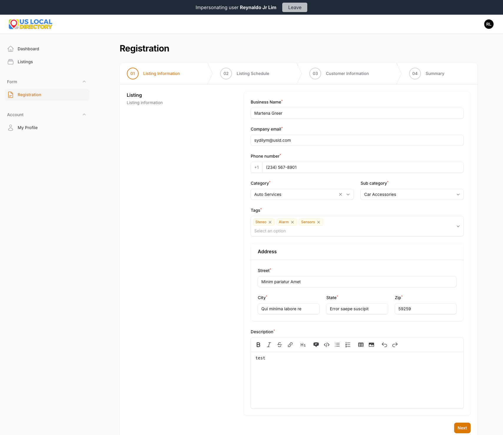
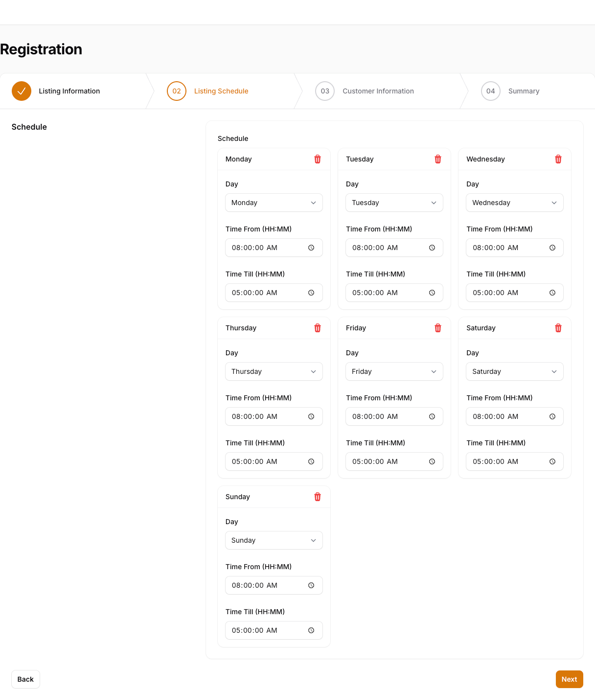
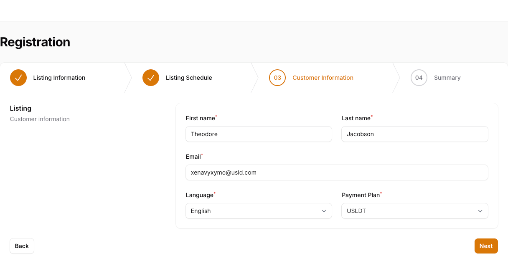
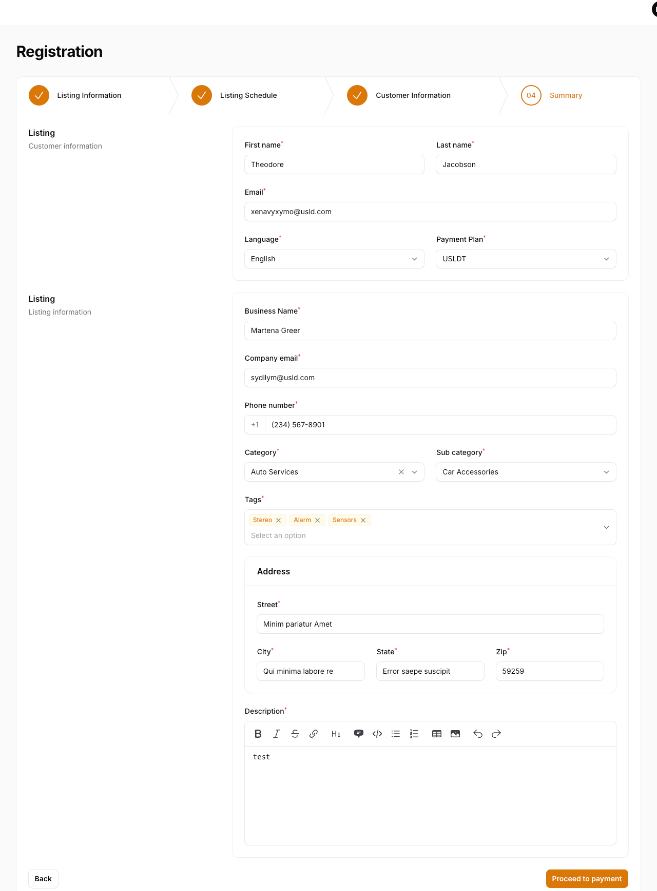
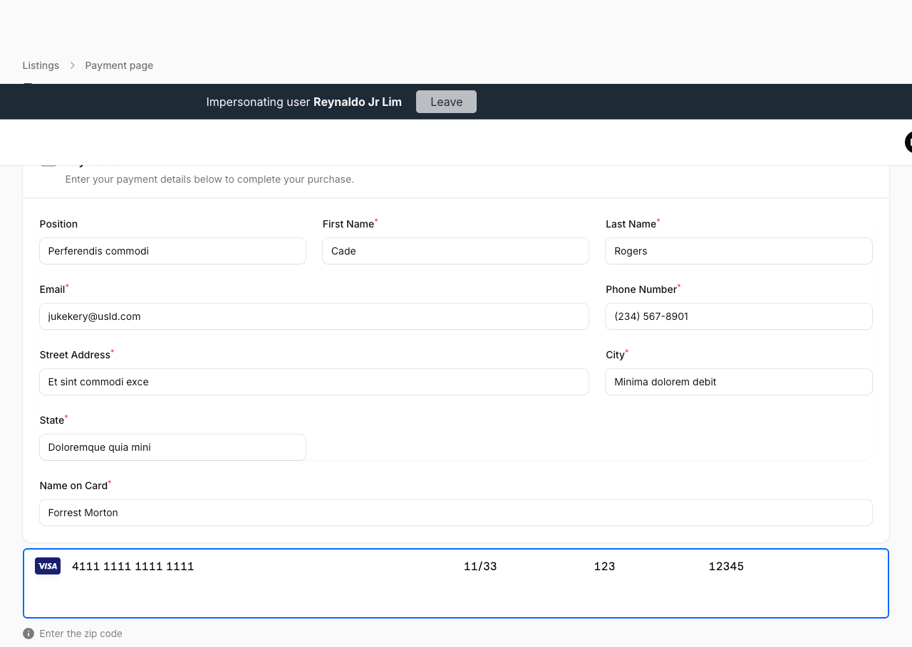

# 🧾 US Local Directory — Registration & Payment Guide

## Overview
The US Local Directory platform allows businesses to register their listings, define schedules, input customer information, and proceed with payment — all in a streamlined, step-by-step process.

---

## Step 1: Listing Information

### 📋 Purpose
Collect basic details about your business.

### 🧭 Fields
1. **Business Name** — Enter your company or business name.
2. **Company Email** — Provide a valid business email address.
3. **Phone Number** — Input your contact number with country code.
4. **Category** — Choose the main business category (e.g., *Auto Services*).
5. **Sub Category** — Select the relevant subcategory (e.g., *Car Accessories*).
6. **Tags** — Add descriptive tags related to your business (e.g., *Stereo, Alarm, Sensors*).
7. **Address Section**
   - **Street** — Enter your street name or building address.
   - **City** — Enter your city.
   - **State** — Enter your state or province.
   - **Zip** — Provide your postal code.
8. **Description** — Write a short description of your services or products.

### Screenshot

### ➡️ Action
Click **Next** to proceed to the *Listing Schedule* step.

---

## Step 2: Listing Schedule

### 🧭 Purpose
Set your business operating hours.

### 🗓️ Fields
For each day of the week:
1. **Day** — Select the day (e.g., Monday, Tuesday, etc.).
2. **Time From** — Specify the opening time.
3. **Time Till** — Specify the closing time.
4. 🗑️ **Delete Icon** — Remove a day if not applicable.

### Screenshot

### ➡️ Action
After setting your weekly schedule, click **Next** to continue to *Customer Information*.

---

## Step 3: Customer Information

### 🧭 Purpose
Provide customer contact and payment preference details.

### 👤 Fields
1. **First Name** — Enter your given name.
2. **Last Name** — Enter your family name.
3. **Email** — Enter your email address.
4. **Language** — Choose your preferred language (e.g., *English*).
5. **Payment Plan** — Select the desired plan (e.g., *USLDT*).

### Screenshot

### ➡️ Action
Click **Next** to review your information.

---

## Step 4: Summary

### 🧭 Purpose
Review all the entered details before payment.

This page displays:
- **Customer Information** — Name, Email, Language, Payment Plan.
- **Listing Information** — Business details, category, address, and description.

### Screenshot

### ✅ Action
Confirm everything is correct, then click **Proceed to Payment**.

---

## Step 5: Payment

### 🧭 Purpose
Complete your registration with a secure payment.

### 💳 Fields
1. **Position** — Enter your job title or role.
2. **First Name / Last Name** — Enter your billing name.
3. **Email** — Provide your email for receipt.
4. **Phone Number** — Add your contact number.
5. **Street Address / City / State** — Enter your billing address.
6. **Name on Card** — Input the name exactly as it appears on your card.
7. **Card Details**
   - **Card Number** — Enter your 16-digit card number.
   - **Expiry Date (MM/YY)** — Enter the expiration date.
   - **CVV** — Enter the 3-digit security code.
   - **Zip Code** — Enter your billing postal code.

### Screenshot

### 💰 Action
Click **Pay** or **Submit** (depending on implementation) to complete the registration.

---

## ✅ Completion
After successful payment:
- You’ll receive a confirmation email.
- Your listing will be added to the US Local Directory database.
