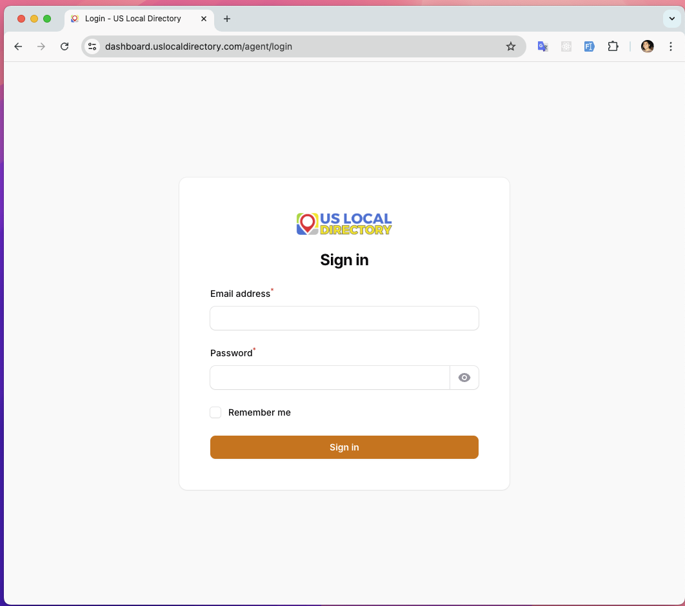

# 🔐 US Local Directory — Signin Guide

## Overview
The US Local Directory platform provides role-based access through different signin portals. Each role has a specific URL and dashboard tailored to their responsibilities and permissions.

---

## 🌐 Signin URLs by Role

### 👤 Customer Portal
**URL:** https://dashboard.uslocaldirectory.com/customer

**Purpose:** For business owners and customers to manage their listings, view analytics, and update business information.

**Access Level:** Standard user access with listing management capabilities.

---

### 🏢 Agent Portal
**URL:** https://dashboard.uslocaldirectory.com/agent

**Purpose:** For sales agents to manage customer accounts, process registrations, and handle customer support.

**Access Level:** Agent-level access with customer management and sales tools.

---

### 👔 Manager Portal
**URL:** https://dashboard.uslocaldirectory.com/manager

**Purpose:** For managers to oversee agent activities, review performance metrics, and manage regional operations.

**Access Level:** Management-level access with team oversight and reporting capabilities.

---

### 👨‍💼 Supervisor Portal
**URL:** https://dashboard.uslocaldirectory.com/supervisor

**Purpose:** For supervisors to monitor operations, review reports, and coordinate between different departments.

**Access Level:** Supervisor-level access with cross-departmental visibility and coordination tools.

---

### 🛡️ Admin Portal
**URL:** https://dashboard.uslocaldirectory.com/admin

**Purpose:** For system administrators to manage the entire platform, configure settings, and oversee all user roles.

**Access Level:** Full administrative access with system-wide control and configuration capabilities.

---

## 🔑 How to Sign In

### Step 1: Access Your Role-Specific URL
1. Open your web browser
2. Navigate to the appropriate URL for your role (see URLs above)
3. Bookmark the URL for quick future access

### Step 2: Enter Your Credentials
1. **Email/Username** — Enter your registered email address or username
2. **Password** — Enter your secure password
3. **Remember Me** (optional) — Check this box to stay logged in on trusted devices

### Screenshot

### Step 3: Access Your Dashboard
1. Click **Sign In** or **Login** button
2. You'll be redirected to your role-specific dashboard
3. Begin managing your responsibilities within the platform

---

## 🚨 Important Notes

### Security Guidelines
- **Never share your login credentials** with other users
- **Use strong passwords** with a mix of letters, numbers, and symbols
- **Log out** when finished, especially on shared computers
- **Report any suspicious activity** to your administrator immediately

### Role Access Restrictions
- Each role has **specific permissions** and cannot access features outside their scope
- **Cross-role access** requires appropriate authorization from administrators
- **URL access is restricted** — attempting to access a higher-level role URL without permissions will be denied

### Troubleshooting
- **Account Locked:** Contact your supervisor or administrator
- **Wrong Role Access:** Verify you're using the correct URL for your assigned role
- **Technical Issues:** Contact technical support with your role and specific error details

---

## 📞 Support Contacts

### For Account Issues
- **Customers:** Contact your assigned agent
- **Agents:** Contact your manager or supervisor
- **Managers/Supervisors:** Contact system administrators
- **Admins:** Contact technical support team

---

## ✅ Quick Reference

| Role | URL | Primary Function |
|------|-----|------------------|
| Customer | https://dashboard.uslocaldirectory.com/customer | Manage business listings |
| Agent | https://dashboard.uslocaldirectory.com/agent | Customer support & sales |
| Manager | https://dashboard.uslocaldirectory.com/manager | Team oversight & reporting |
| Supervisor | https://dashboard.uslocaldirectory.com/supervisor | Operations monitoring |
| Admin | https://dashboard.uslocaldirectory.com/admin | System administration |

---

*Last updated: October 21, 2025*